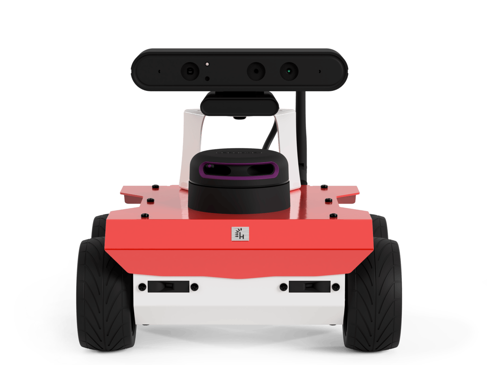
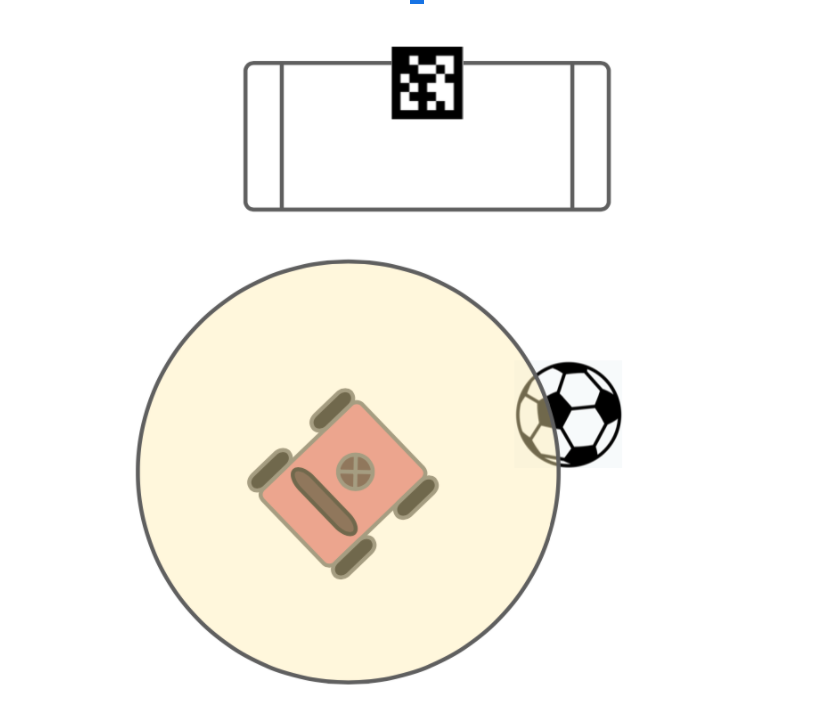
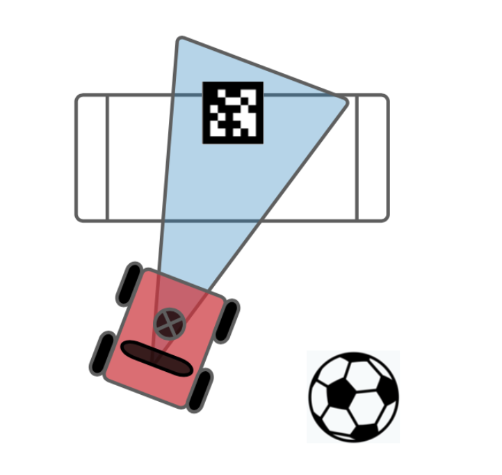
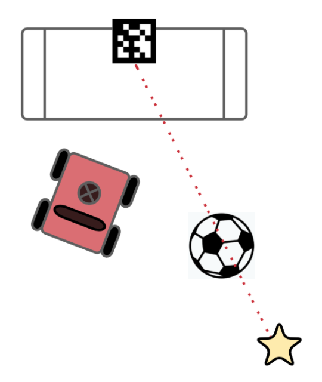
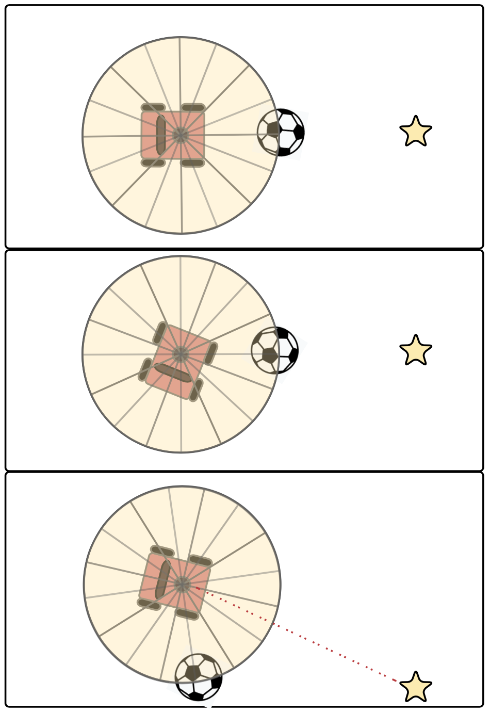

For the final project of my Autonomous Mobile Robots class, my team programmed a Husarion ROSbot 2R to shoot a soccer ball into a goal.

### Husarion ROSbot 2R Features

- 360° laser scanner (RPLIDAR A2)

- IMU (BNO55)

- 4 DC motors with quadrature encoders

- Orbbec Astra RGB and depth camera (640x480)

	
    
Husarion ROSbot 2R

### Ball Detection and Localization

To obtain the ball’s coordinates, we programmed the robot to scan its surroundings and identify the nearest object using LIDAR, assuming the ball would always be closest in an empty field. We averaged LIDAR readings over the first 20 cycles (1-2 seconds) for a better estimate, then resolved the distance into x and y components to generate destination coordinates relative to the robot.

	
    
Ball Detection Using LIDAR

### Goal Localization

We used the ROS wrapper for AprilTag 3 to visually detect the goal’s coordinates. AprilTags, similar to QR codes, encode 3D position, orientation, and identifiers. The ROS wrapper allowed us to determine the pose of detected tags, enabling accurate goal localization. We used the 36h11 tag family, rescaled a PNG for printing, and taped it above the goal.

	
    
Goal Detection Using AprilTags and Camera

### Move-to-Kicking-Pose

We implemented a go-to-goal behavior to move the robot to its desired kicking pose - $x_d$, $y_d$, $θ_d$, using a PID controller for velocity and a proportional controller for steering. Destination coordinates were computed from the angle and distance between the goal and ball, accounting for ball diameter and kicking distance. Once within a threshold, the robot rotated to align with both ball and goal.

	
    
Determining Target Coordinates

### Obstacle Avoidance

As an extension of Move-to-Kicking-Pose, we added obstacle avoidance for cases where the ball was between the robot and its pose. The robot used LIDAR to scan for obstacles, dividing the field of view into angular sectors to identify if obstacles were ‘in path’. If so, the robot turned until the obstacle was in a peripheral segment, maintaining proximity without collision. This adjustment allowed the robot to circumnavigate obstacles and resume its trajectory once clear.

	
    
Obstacle Avoidance

### Kicking

The robot kicked by moving at a consistent linear velocity along the determined trajectory, with velocity proportional to the distance between ball and goal to adjust kick intensity.

### Behavior Coordination

We implemented a state machine to coordinate behaviors. The robot began with Ball Detection and Localization, then Goal Localization, using those poses as input for Move-to-Kicking-Pose. It navigated to the kicking pose, entered Obstacle Avoidance if needed, and finally kicked the ball into the goal.

_Credit to my teammates, Derek Johnson, Garrett Moore, Rohan Nair_