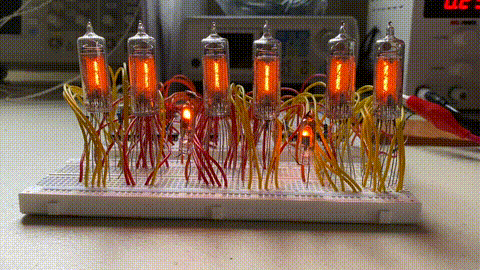
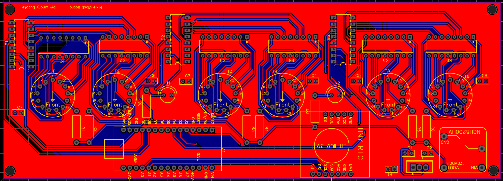

During the initial months of the COVID pandemic, I discovered the art of making nixie clocks in a youtube video. With lots of time on my hands in between semesters, I decided to design a PCB and housing, having taken a circuit design course in my previous semester.

### Tube Selection

With a large variety of [Nixie Tubes](https://en.wikipedia.org/wiki/Nixie_tube) available, I decided on IN-14s as a moderate sized tube for a clock.

  

    
    
IN-14 Nixie Tube

  

  

    
    
IN-14 Pinout

  

### Tube and Driver Pinouts

The pinout for these is pretty straightforward, with individual pins controlling indvidual digit. Connecting the digit pin to ~170 V and the anode pin to ground results in that digit lighting up.

  

Adding a driver to handle the decoding makes things easier. I opted for the K155ID1 BCD-to-Decimal decoder. Using the provided truth table, enabling different numbers is simple.

  

    
    
K155ID1 Truth Table

  

  

    
    
K155ID1 Pinout

  

Sidenote, these tubes require high voltages ~170V to excite the gases inside. I am using a NCH8200HV DC-DC converter to step 12V up to the 170V necessary to power the tubes. 

### Circuit Control

For pin control, I opted to use an arduino nano for its small form-factor and ease-of-use. Combining the arduino, the NCH8200HV, a K155ID1, and a 12V DC power supply - I started with some testing on a breaboard setup. In addition to the IN-14 I also added a smaller dotlike tube to separate the digits of the clock. With this setup I tested cycling through digits.

  
  
Single Nixie + Dot

### Testing

After checking out this single tube setup, I went ahead with testing a 6-digit clock + dot separator setup. After some tedious wiring, I was able to get the system working.

  
  
6-Digits + Dots

### Final Touches

To round out the circuit, I added a TINY RTC clock module to keep time in between power cycles. then I designed a PCB to put it all together.

  
  
PCB Design

After having the board manufactered, I soldered everything together I cut and finished a housing out of some wood we had laying around in the garage.

  
  
Final Clock

