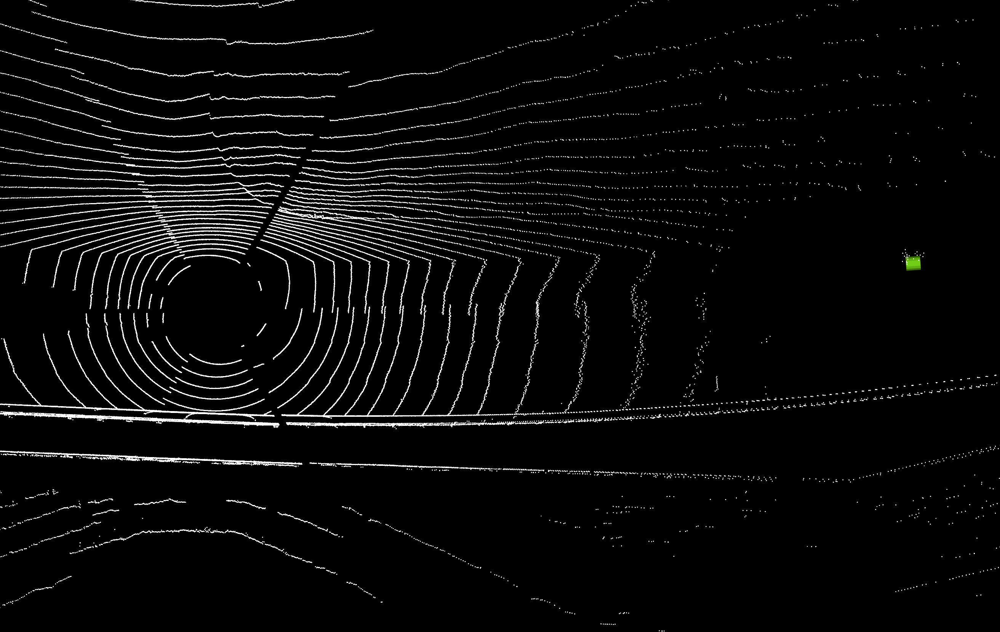
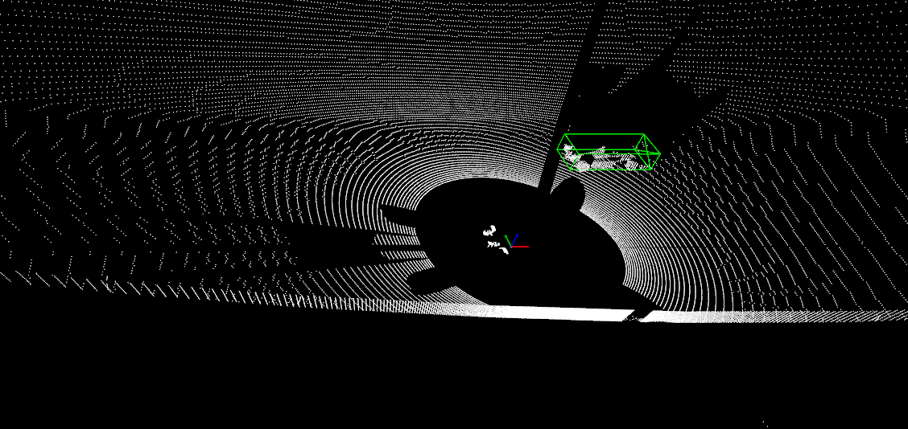
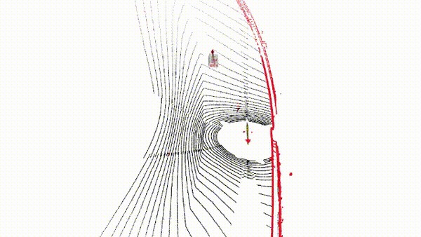
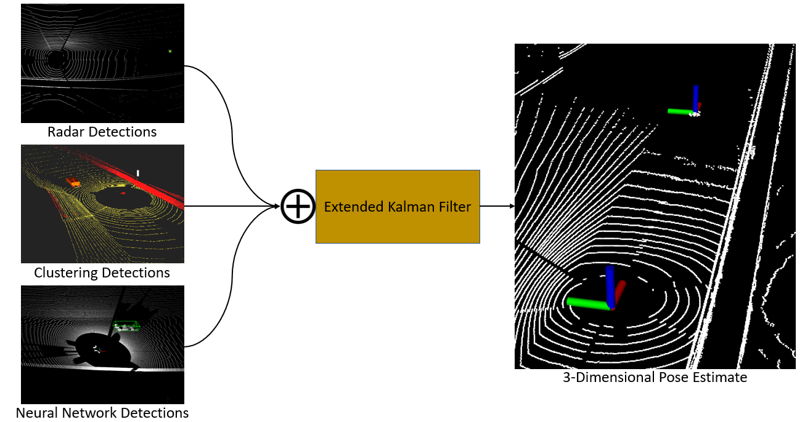
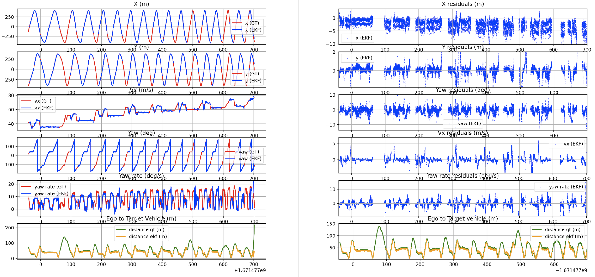

Extending upon the individual detection algorithm in the Radar Perception Pipeline project page, we aimed to combine our different perception pipeline estimates to create a single combined opponent track. First lets go through each of our modalities.

### Radar Object Opponent Detection

The details of the radar detection pipeline are very explicitly explained in the Radar Perception Pipeline project page, so I will not go into details here. But, we can recall that we receive radar tracks at a rate of 20 Hz. An example of one of those tracks is shown below.

	
    
Single Radar Track

### Radar Detection Characteristics

Strengths:

- Much longer range, up to 90m in front on turns and up to 120m on straights

- Good velocity estimate for tracking

- Lightweight

Drawbacks:

- Somewhat noisy

- No detections behind the vehicle

In addition to the radar data, we also had 3 luminar LIDARs on the AV-21. These were in a configuration to provide 360 degree coverage, and point clouds came in at 20 Hz. In addition to the radar pipeline, we had two pipelines for LIDAR detection data as well. Note: I am presenting these methodologies to describe the overall filtering, I was not the primary developer on either of these LIDAR modalities - outside of helping to generate training data. 

### DNN Object Opponent Detection

One of the other modalities we used was a DNN-based detection system. We first created training data using several of the datasets collected at various racetracks. Then we went through testing different models, in particular [PointRCNN](https://github.com/sshaoshuai/PointRCNN) and [PointPillars](https://arxiv.org/pdf/1812.05784), the model we ended up choosing was PointPillars. Here's an example of how we added bounding boxes to create our training data. 

	
    
Labeled Data for DNN Training

### DNN Detection Characteristics

Strengths:

- Long range, up to 90m in front 60 m behind

- Speed, clouds in at 20 Hz detections out at 12 Hz

- Good orientation estimate

Drawbacks:

- Does not perform as well on banked turns, range limited to ~50m

### Euclidean Clustering Opponent Detection 

The second LIDAR methodology we used was a euclidean clustering based technique. This approach uses a more classical clustering the approach, representing the cloud as a kd-tree and adding points to clusters based on radial distance. This method heavily relies on a ground-filtered point cloud being fed into the algorithm - this algorithm happens in a previous step. Here is a short snippet of the clustering output:

	
    
Euclidean Clustering Results

### Euclidean Clustering Characteristics

Strengths:

- Accurate

Drawbacks:

- Somewhat slow, clouds come in at 20 Hz clustering outputs at 6-10 Hz

- Limited range: approximately 50 m forwards and backwards due to the sparsity of points as distance increases

### Health Filters

Before feeding these detections to our tracking filter, we decided to add an extra layer of filtering to reduce false calls affecting the output. We called this the "healthy" filter, and each of the modalities had their own slight variants. The general form of these health filters was as follows:

1. On new track `(pose, time)`:
   - Add to history  

   - Remove entries older than `T`  

2. Count tracks near same pose within `T`  

3. If `count ≥ N` → **Pass Detection Through**  
   Else → **Drop Detection**

### Tracking EKF

Following a detection being deemed "healthy", we pass it directly to an opponent tracking EKF. For our ekf we used [robot localization](https://github.com/cra-ros-pkg/robot_localization) and manually tuned our process noises within the omnidirectional motion model. 

	
    
Opponent Tracking Block Diagram

For initialization and deinitialization of tracks, upon receiving a healthy stream of at least 1 of the sensors, we toggle the EKF estimate on. Upon all the streams going stale, we deinitialize and reset the EKF for future tracks. 

We compared our EKF estimate from some ground truth from the RACECAR dataset, the residuals are shown below:

	
    
Opponent Tracking State Residuals

From these residual plots, one can see that the max error in the longitudinal (X) direction was on average ~5 meters and the max error in the lateral (Y) direction was ~2 meters for evaluation on one of our datasets.

_Credit to my perception team teammates John Chrosniak, Max Dawkins, Utkarsh Chirimar, Trent Weiss and others_