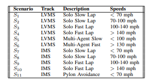
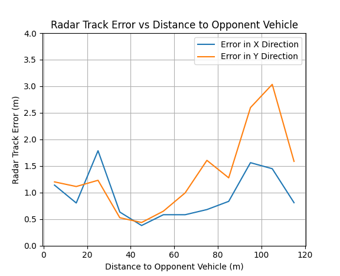
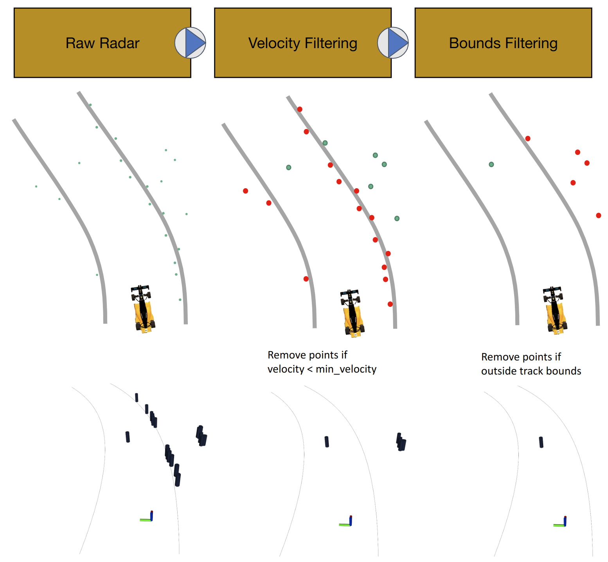

Following the initial IMS (2021) and LVMS (2022) races, there was an effort led by our team principal, Professor Behl, to gather data from several teams to contribute to a publicly available dataset. Toward this effort, I helped comb through many of the data recordings our team had accumulated. We identified the type of scenario, speed bounds, and locations to help generate a full catalog of scenarios.

The final make-up of data came from several teams, covering a broad spectrum of scenarios. Here is the final breakdown:

	
    
RACECAR Dataset Scenarios

Additionally, we provided benchmarks for different sensors as part of a paper to make a baseline for users of the dataset to compare to. I provided the benchmark algorithm for the radar detection. I also generated data on the expected error in the longitudinal (X) and lateral (Y) direction. The resultant plots are shown below:

	
    
Radar Sensor Error

I also provided the reference algorithm and algorithm description for what we used in our radar detection pipeline. The block diagram and reference images are shown below. 

	
    
Radar Algorithm Diagram

There is an assocaited [paper](https://arxiv.org/abs/2306.03252) for more details and [github](https://github.com/linklab-uva/RACECAR_DATA) with explanation for how to use the dataset as well.

_Credit to Amar Kulkarni for pulling the whole thing together_
