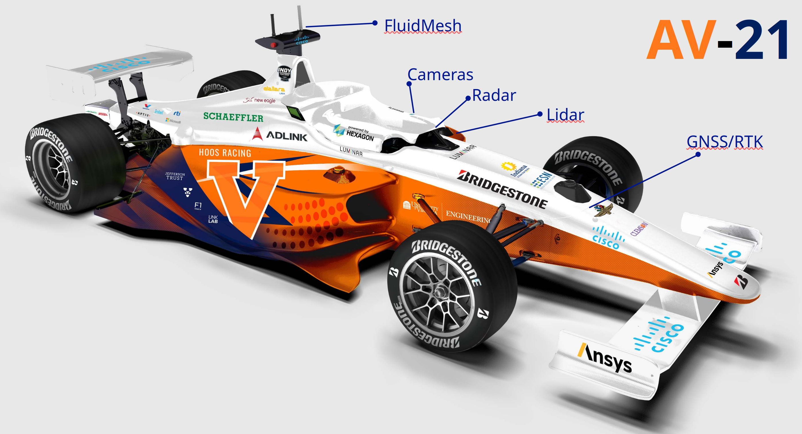
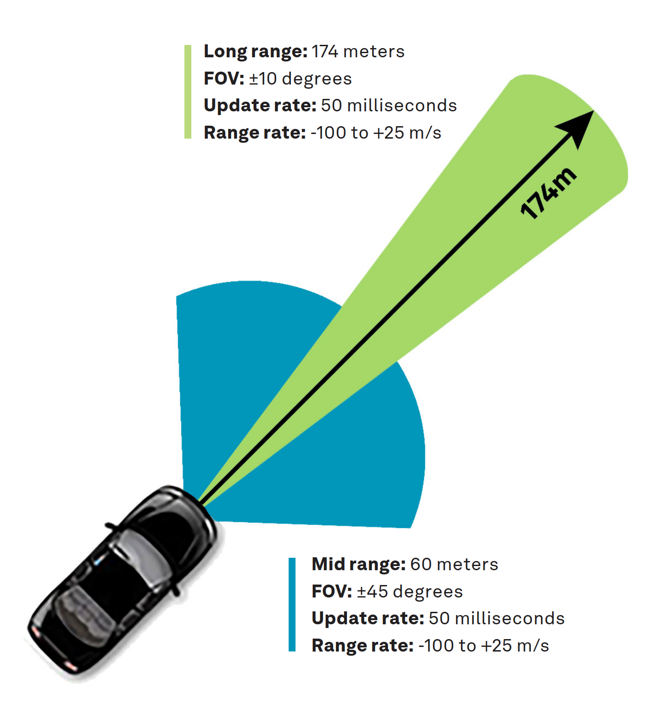

As part of my time on the UVA Cavalier Autonomous Racing (CAR) team, I worked primarliy on the radar perception pipeline. As part of the CAR team, I participated in several races as part of the Indy Autonomous Challenge - Indianapolis Motor Speedway 2021, Las Vegas Motor Speedway 2022, Texas Motor Speedway 2022, Las Vegas Motor Speedway 2023. The base vehicle all the teams used was the AV-21.

	
    
AV-21 Vehicle

### Aptiv ESR Radar

The sensor I primarily interfaced with was the Aptiv Electronically Scanning Radar 2.5. The Aptiv ESR 2.5 operates at 76.5 GHz and has multi-modal funtionality in both mid-range and long-range. The mid-range component has a horizontal FOV of 90 degrees with a max detection distance of 60 meters. The long-range component has a horizontal FOV of 20 degrees with a max detection distance of 174 meters. This multi-modal sensor ensures that we get coverage on both straights and turns of various tracks.

	
    
Radar FOV

	
    
Radar FOV

