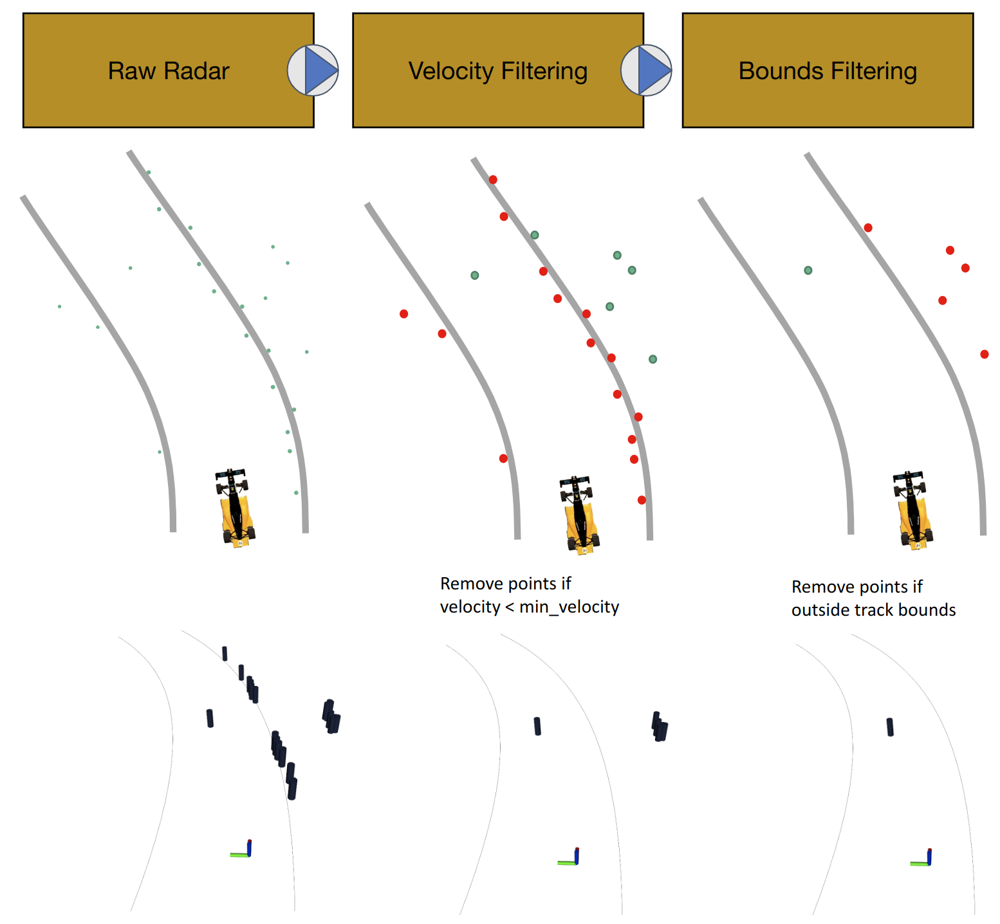

As part of my time on the UVA Cavalier Autonomous Racing (CAR) team, I worked primarliy on the radar perception pipeline. As part of the CAR team, I participated in several races as part of the Indy Autonomous Challenge - Indianapolis Motor Speedway 2021, Las Vegas Motor Speedway 2022, Texas Motor Speedway 2022, Las Vegas Motor Speedway 2023. The base vehicle all the teams used was the AV-21.

<div style="text-align:center; margin: 1.5rem 0;">
	
    <div style="font-size:1.1rem; color:#444; margin-top:0.5rem;">AV-21 Vehicle</div>
</div>

### Aptiv ESR Radar

The sensor I primarily interfaced with was the Aptiv Electronically Scanning Radar 2.5. The Aptiv ESR 2.5 operates at 76.5 GHz and has multi-modal funtionality in both mid-range and long-range. The mid-range component has a horizontal FOV of 90 degrees with a max detection distance of 60 meters. The long-range component has a horizontal FOV of 20 degrees with a max detection distance of 174 meters. This multi-modal sensor ensures that we get coverage on both straights and turns of various tracks.

<div style="text-align:center; margin: 1.5rem 0;">
	
    <div style="font-size:1.1rem; color:#444; margin-top:0.5rem;">Radar FOV</div>
</div>

The radar publishes up to 64 distinguishable tracks along with details about the track. The driver from [AutonomousStuff](https://autonomoustuff.atlassian.net/wiki/spaces/RW/pages/17509820/Delphi+ESR) publishes this data on the `EsrTrack` message shown below:

```
std_msgs/Header header

# ESR Track
string        canmsg

uint8         id
float32       lat_rate
bool          grouping_changed
bool          oncoming
uint8         status
float32       angle
float32       range
bool          bridge_object
bool          rolling_count
float32       width
float32       range_accel
uint8         med_range_mode
float32       range_rate
```

With this message we are able to resolve its relative position with the angle, range fields. There is other useful information like the `range_rate` which effectively gives us the relative velocity of the target to the sensor. There are also some other field that are less useful to this application, like `bridge_object`, which indicates if the detected object is likely a bridge - a useful indicator in ADAS systems.

### Filtering

The sensor updates at 20 Hz, so with a possible

$$
64\ tracks * 20\ cycles = 1280\ tracks\ per\ second
$$

it is useful to do some heavy filtering before trying to process all of those. As a first pass, its trivial to think about the speeds the vehicles will be going. We can expect that while on a racetrack with other vehicles, any object with a similar velocity to the ego is likely a valid track. We can use the `range_rate` value discussed earlier to do a filtering pass.

```
if (!(abs(track->track_range_rate) < odom->twist.twist.linear.x*vel_scalar))
{
    return;
}
```

Where `vel_scalar` functions to allow a wider range of values as the vehicle's linear velocity increases. This pass functions to drop many of the non-interesting tracks, as the racetrack walls and other metal structures get picked up pretty easily.

<div style="text-align:center; margin: 1.5rem 0;">
	
    <div style="font-size:1.1rem; color:#444; margin-top:0.5rem;">Radar Unfiltered</div>
</div>

Looking at the unfiltered data, many tracks outside track bounds also stand out. Another tool we used for filtering, was our estimate of the track bounds. Prior to racing at a particular track, we create maps of the outer bound and inner bound of the racetrack as well as several different racelines.

<div style="text-align:center; margin: 1.5rem 0;">
	
    <div style="font-size:1.1rem; color:#444; margin-top:0.5rem;">Track Bounds and Racelines at LVMS</div>
</div>

Using localization estimate, we can grab slice of bounds in global frame and transform it to local frame. Then we can create a polygonal convex hull structure of n points of the slice and cycle through tracks, removing any that are outside of the hull where lookup is O(log n).

<div style="text-align:center; margin: 1.5rem 0;">
	
    <div style="font-size:1.1rem; color:#444; margin-top:0.5rem;">Convex Hull Filtering</div>
</div>

The stages of the full algorithm are shown below.

<div style="text-align:center; margin: 1.5rem 0;">
	
    <div style="font-size:1.1rem; color:#444; margin-top:0.5rem;">Radar Algorithm Diagram</div>
</div>

The results of applying this algorithm to one of our datasets is shown below. As we approach the other vehicle from behind, the filtered radar tracks (dark blue boxes) are clearly visible. As a sidenote the gray boxes that appear when the vehicles are close together is the result of the LIDAR methods. 