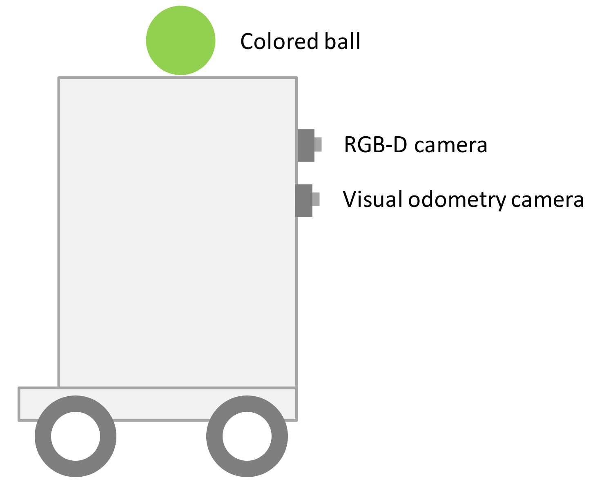
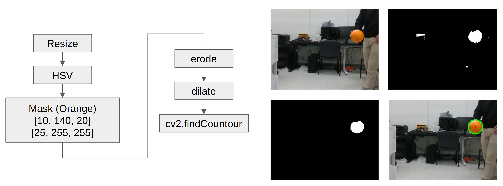
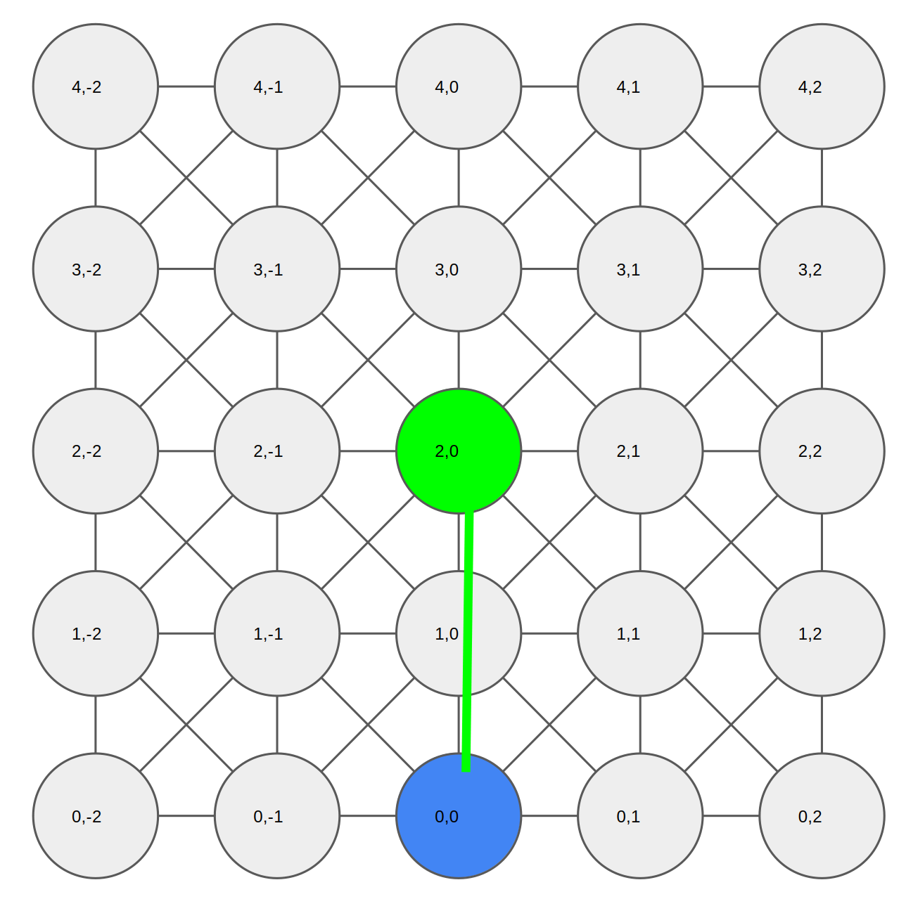
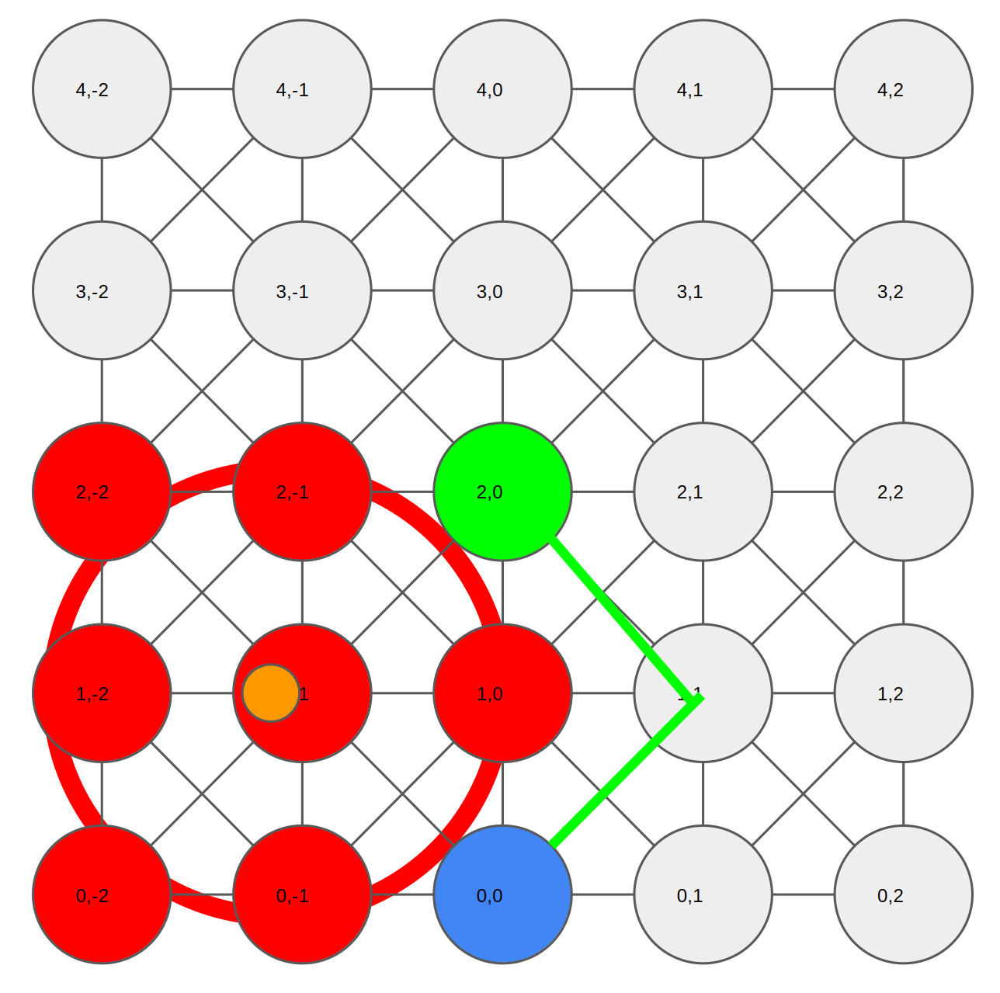

For one of my classes in college, the final project was to have two robots play a game of chicken. The rules were as follows:

### Game Rules

- Both robots start ~ 10ft apart directly facing each other

- Both robots will have a colored dodgeball on top of them

- The first robot to reach the other robots start position wins

### Robot features

- 4 direct-drive motors w/encoders

- Intel T265 Odomety

- Intel Realsense D435i Camera

- Intel NUC PC

	

### Opponent Detection

Given we knew that our opponent would always have an orange ball on top of their robot, we used some basic image processing methods.

1. Resize - dimensionality was downsampled to process faster

2. HSV Conversion - the image was converted from RGB to HSV

3. Orange filter - a color filter was applied to mask out non-orange pixels

4. Erosion - removes small bits of white noise

5. Dilation - enlarges remaining object and fills holes

6. Find Contours - find the contour of the remaining circle of the ball 

	

From the D435i datasheet, the sensor has a 74 degree FOV and a horizontal pixel width of 640. Using this information we can calculate an approximate bearing at a given horizontal pixel index. The sensor also provides a depth estimate at each pixel with a min distance of 175 mm. 

### Opponent Tracking

With a given bearing, range estimate for our orange ball from the camera sensor, we can now proceed with tracking the opponent using our detections. We did that with an Extended Kalman Filter.

#### Motion Model

Differential Motion Model  

Control, angular velocity of left and right wheels:

$$
\mathbf{u} = 
\begin{bmatrix}
\omega_l \\\\
\omega_r
\end{bmatrix}
$$

For the ball detection, the height is fixed and we only consider $x$, $y$, and $\theta$.

$$
\begin{bmatrix}
\dot{x} \\\\
\dot{y} \\\\
\dot{\theta}
\end{bmatrix} =
\begin{bmatrix}
\frac{R_w}{2\eta} \ (\omega_l + \omega_r) \cos\theta \\\\
\frac{R_w}{2\eta} \ (\omega_l + \omega_r) \sin\theta \\\\
\frac{R_w}{l\eta} \ (\omega_r - \omega_l)
\end{bmatrix}
$$

where $R_m$ is the motor radius, $R_w$ is the wheel radius, and $\eta = \frac{R_w}{R_m}$.

#### Sensor Model

Polar sensor to cartesian location:

$$
\mathbf{x} = d\sin(\theta) \\ 
\mathbf{y} = d\cos(\theta)
$$

and their associated noise matrix:

$$
\Sigma ^{polar} = \begin{bmatrix}
\sigma _{R} & 0 \\\\
0 & \sigma _{\theta} \\
\end{bmatrix}
$$

In cartesian form:

$$
\Sigma ^{cartesian} = \mathbf{J} \Sigma ^{polar} \mathbf{J} ^{T}
$$

We based our EKF impelementation in these equations, running as a ros node on the vehicle.

### Localization

For this project in this course, the main focus was the opponent detection. For localization, the professor provided an off-the-shelf slam library for us to use with the D435i - isolating the opponent detection and trajectory planning as the main portion of the project

### Trajectory Generation

Given the small state space our robot could occupy, we decided to break the chicken battlefield into a discrete grid. Mapping a position in the SLAM map to a position in our discrete grid made it more simple to whip up a trajectory planner.

- The grid is connected both adjacently and along the diagonal

- Each edge has a weight of 1

- The goal cell is a fixed distance ahead of the origin

	

We mapped both our location and the opponent location into the discrete grid, which we can use to calculate a shortest path using Dijkstra's algorithm. Upon detecting the opponent, we increase the cost of trajectories in a buffer region around the opponent while rewarding achieving the goal location

	

This naive discrete grid-based technique worked well enough for the final project, and we were one of the few teams with a non-hardcoded competition trajectory.

_Credit to my teammates, Xuhui Kang and Yu-Sheng Wang_